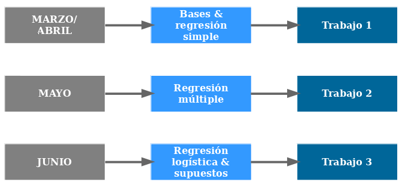
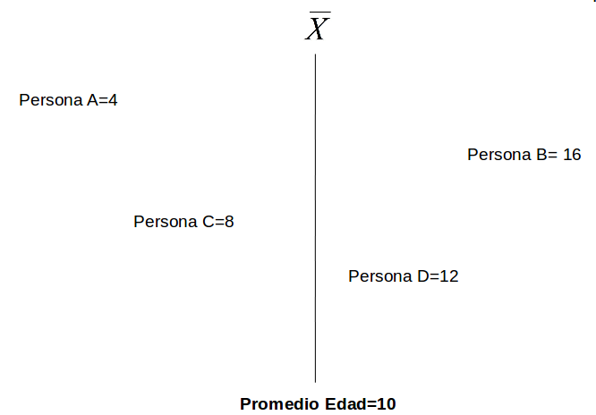
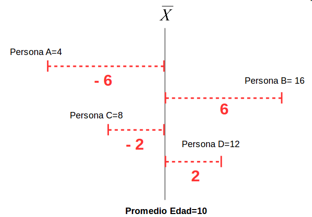
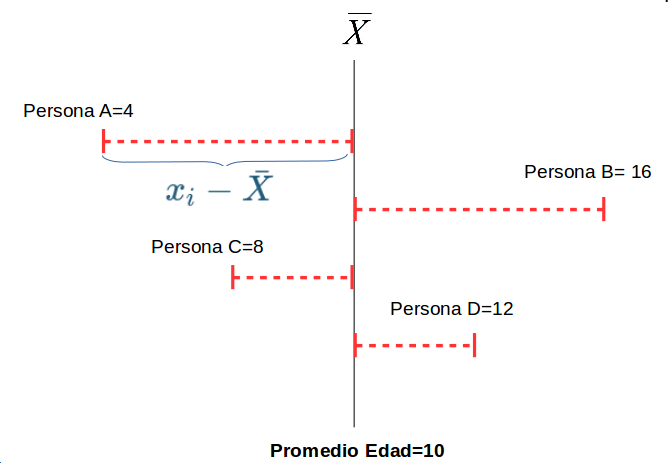
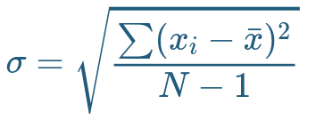

class: front, hide-logo


<!---
Para correr en ATOM
- open terminal, abrir R (simplemente, R y enter)
- rmarkdown::render('static/docpres/07_interacciones/7interacciones.Rmd', 'xaringan::moon_reader')

About macros.js: permite escalar las imágenes como [scale 50%](path to image), hay si que grabar ese archivo js en el directorio.
--->


.pull-left[
# Estadística Multivariada
## Juan Carlos Castillo
## Sociología FACSO - UChile
## 1er Sem 2021
## [multivariada.netlify.com](https://multivariada.netlify.com)
]


.pull-right[
.right[

<br>
# Sesión 2: Bases
]

]


???


```{=html}
<style>.shareagain-bar {
--shareagain-foreground: rgb(255, 255, 255);
--shareagain-background: rgba(0, 0, 0, 0.5);
--shareagain-twitter: none;
--shareagain-facebook: none;
--shareagain-linkedin: none;
--shareagain-pinterest: none;
--shareagain-pocket: none;
--shareagain-reddit: none;
}</style>
```

---
class: inverse

## Contenidos
   
 
1. Repaso de sesión anterior

2. Datos y variables 

3. Bases: Tendencia central y dispersión

4. Correlación 

---
class: roja, middle, center

# 1. Repaso sesión anterior

---
## Estadística multivariada

- Hacia la **explicación** de los fenómenos sociales


---
## Estadística multivariada

- Hechos sociales: **multicausales**


---

## Estadística multivariada 

- Intentando dar cuenta de la complejidad: **modelos matemáticos**

--

.center[

]
- A partir de un modelo matemático denominado **regresión**, este curso busca entregar **herramientas** de análisis de datos que permitan aproximarse a la **explicación** de fenómenos sociales **multicausales**.


---
class: middle, center

# Más sobre explicación en:  

##-  [Lizon (2006) Estadística y causalidad en sociología](/docs/lecturas/Lizon 2006 Estadistica y causalidad en sociologia.pdf)

##-  [Moore: 1.Comprensión de los datos (1-54)](/docs/lecturas/moore_comprensiondelosdatos.pdf)


---




---
class: roja, center, middle

# 2. Bases
## Datos y variables
## Tendencia central y variabilidad
## Correlación

---
class: roja, center, middle

# 2. Bases

.large[##.yellow[Datos y variables]]

## Tendencia central y variabilidad
## Correlación


---
## Datos

* Los datos miden al menos una *característica* de a los menos una *unidad*  en a lo menos *un punto en el tiempo*

--
 + Ejemplo: La esperanza de vida en Chile el 2017 fue de 79,9 años

   - Característica (variable) : esperanza de vida

   - Unidad: Años

   - Punto en el tiempo: 2017

---
## Base de Datos

* Forma "rectangular" de almacenamiento de datos:

.center[]

---
## Base de Datos

  - cada .blue[fila] representa una unidad o caso (ej: un entrevistad_)
  
  - cada .orange[columna] una variable (ej: edad)
  
  - cada .purple[variable] posee valores numéricos
  
  - los valores numéricos pueden estar asociados a una etiqueta (ej: 1=Mujer)


---
## Ejemplos de estudios / bases de datos

1. [Encuesta Centro de Estudios Públicos](https://www.cepchile.cl/cep/site/edic/base/port/encuestacep.html)

2. [Encuesta CASEN](http://observatorio.ministeriodesarrollosocial.gob.cl/casen-multidimensional/casen/casen_2017.php)

3. [Encuesta Lapop](https://www.vanderbilt.edu/lapop-espanol/)

4. [ELSOC](https://coes.cl/encuesta-panel/)

---
## Variables

- Una variable representa cualquier cosa o propiedad que varia y a la cuál se le asigna un valor. Es decir:

- $Variable \neq Constante$

- Pueden ser visibles o no visibles/latentes. (Ej: peso / inteligencia)

---
## Variables

- discretas (Rango finito de valores):

      - Dicotómicas
      - Politómicas

- continuas:

      - Rango (teóricamente) infinito de valores.

---
## Escalas de medición de variables 

- NOIR: Nominal, Ordinal, Intervalar, Razón

.small[
| Tipo       	| Características                     	        | Propiedad de números 	| Ejemplo|
|------------	|----------------------------------------------|---------------	|-----------	|
| *Nominal*    	| Uso de números en lugar de palabras 	| Identidad            	| Nacionalidad      	|
| *Ordinal*    	| Números se usan para ordenar series 	| + ranking            	| Nivel educacional 	|
| *Intervalar* 	| Intervalos iguales entre números    	| + igualdad           	| Temperatura       	|
| *Razón*      	| Cero real                           	| + aditividad         	| Distancia         	|
]

???

  - Nominal: Números empleados como etiquetas (ej. sexo, raza)

  - Ordinales: Distintas categorías puede sen ordenados en serie. Posición, no distancia. (ej. cargos en una empresa)

  - Intervalares: Escalas de unidades iguales. Diferencia entre dos número consecuntivos refleja diferencia empírica. (ej. Horas del día)

  - Razón: caracterizados por la presencia de un cero absoluto. (ej. frecuencias de eventos)

---
## Tipos de datos en relación a escalas de medición.

* **Datos categóricos**: 

    - pueden ser medidos sólo mediante escalas nominales, u ordinales en caso de orden de rango

* **Datos continuos**:
    - Medidos en escalas intervalares o de razón
    - Pueden ser transformados a datos categóricos

???
Conversión de continuo a categórico: estatura (cm) a categorías bajo – mediano – alto


---
## Descriptivos según tipo de variable

<br>
.small[
|             	| Categórica                      	| Continua                      	| Categ.(y)/Categ.(x)                    	| Cont.(y)/Categ.(x)                	|
|-------------	|---------------------------------	|-------------------------	|------------------------------------------------	|------------------------------------------	|
| **Ejemplo**     	| **Estatus Ocupacional**             	| **Ingreso**                       	| **Estatus Ocupacional (Y) / Género (X)**           	| **Ingreso (Y) / Género (X)**                 	|
| Tabla       	| Frecuencias / porcentajes                  	| $\bar{X}$/sd ... o recodificar en categorías      	| Tabla de Contingencia                          	| Clasificar Y                             	|
| Gráfico     	| Barras                          	| Histograma / boxplot          	| Gráfico de barras condicionado                 	| Histograma, box plot condicionado        	|
]

---
## Tipos de análisis estadístico bivariado

- Variable dependiente (y) : lo que quiero explicar

- Variable independiente (x): lo que me permite explicar la dependiente

.small[
| Variable independiente x 	| Variable dependiente Categórica   	| Variable dependiente Continua        	|
|--------------------------	|-----------------------------------	|--------------------------------------	|
| Categórica               	| Análisis de tabla de Contigencia, Chi2	| Análisis de Varianza ANOVA, Prueba T 	|
| Continua                 	| Regresión Logística 	| Correlación / Regresión Lineal                     	|
]
???

Ojo, técnicamente tambien podemos generalizar los modelos de regresión con variables independientes categoricas, pero esto requiere unas consideraciones menores, que veremos más adelante

---
class: roja, center, middle

# 2. Bases

##Datos y variables

.large[##.yellow[Tendencia central y variabilidad]]
## Correlación

---
## Tendencia Central

* Moda: valor que ocurre más frecuentemente

* Mediana: valor medio de la distribución ordenada. Si N es par, entonces es el promedio de los valores medios

* Media o promedio aritmético: suma de los valores dividido por el total de casos

---
.pull-left-narrow[
## Dispersión:
### Varianza
]

.pull-right-wide[


]

---
.pull-left-narrow[
## Dispersión:
### Varianza
]

.pull-right-wide[


]


---
.pull-left-narrow[
## Dispersión:
### Varianza
]

.pull-right-wide[


]

---
## Dispersión:


---
class: inverse, middle, center

#La VARIANZA equivale al promedio de la suma de las diferencias del promedio al cuadrado

---
##  Desviación Estándar

.pull-left-narrow[

]

.pull-right-wide[
  - Raiz Cuadrada de la varianza.


  - Expresada  en la mismas unidades que los puntajes de la escala original
]


---
class: roja, center, middle

# 2. Bases

##Datos y variables

## Tendencia central y variabilidad

.large[##.yellow[Correlación]]


---
[https://www.menti.com/w2e8w8epgb](https://www.menti.com/w2e8w8epgb)

<iframe src="https://www.mentimeter.com/s/5b8f13fedfd5923a150896a2c43c1ab1/1c42dbf2b932" height="500" width=100% allowfullscreen="true">
</iframe>
 


---
class: inverse, center

<br>

## ¿Cómo puedo saber si una variable se encuentra asociada a otra variable?

--

### Si ambas varían de manera **similar** (covarían)

---
## Correlación

- Medida de co-variación lineal estandarizada

--


- Varía entre -1 y +1

--

- Da cuenta de:
  - *Intesidad*: mientras más cercana a |1|, más intensa
  - *Sentido*: positiva o negativa

--

- Gráficamente se expresa en *nubes de puntos*

---

.center[]

---
class: inverse

# RESUMEN

- Datos y variables

- Tendencia cental

- Dispersión

- Introducción correlación


---
class: roja, left

## Próxima sesión:

- Correlación y regresión simple

- Práctica 2: Descripción de variables

- Lecturas:

  - [.yellow[Salgado (2009) Construyendo explicaciones en sociología]](/docs/lecturas/salgado 2009 modelos sociologia.pdf)
  - [.yellow[Moore: 2. Análisis de relaciones]](/docs/lecturas/moore_analisisderelaciones1.pdf)


---
class: front hide-logo

.pull-left[
# Estadística Multivariada
## Juan Carlos Castillo
## Sociología FACSO - UChile
## 1er Sem 2021
## [multivariada.netlify.app](https://multivariada.netlify.com)
]


.pull-right[
.right[
<br>

]

]
